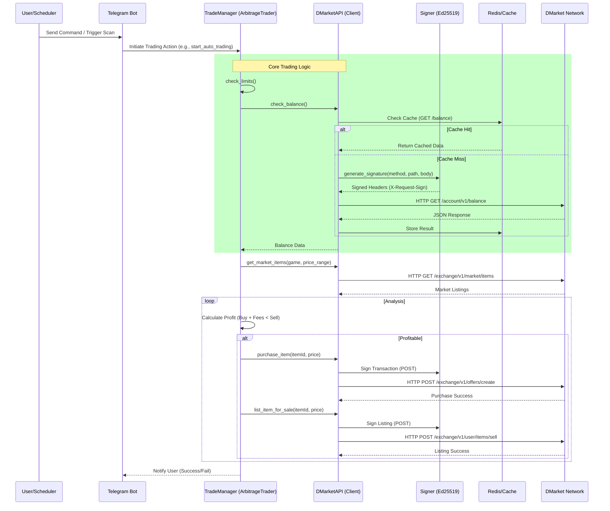

# System Flow Diagram: Critical Chain

This document visualizes the critical data flow for the DMarket Trading Bot, from user interaction/scheduler trigger to the final API call execution.

## Critical Chain Sequence

## Key Components

1.  **Telegram Handler (`src/telegram_bot`)**: Entry point for manual commands.
2.  **Trade Manager (`src/dmarket/arbitrage/trader.py`)**: Central logic for profit calculation, limits, and orchestration.
3.  **API Client (`src/dmarket/api/client.py`)**: Handles HTTP communication, rate limiting, and caching.
4.  **Signer (`nacl.signing`)**: Crucial security component. Requests *must* be signed with Ed25519 key.
