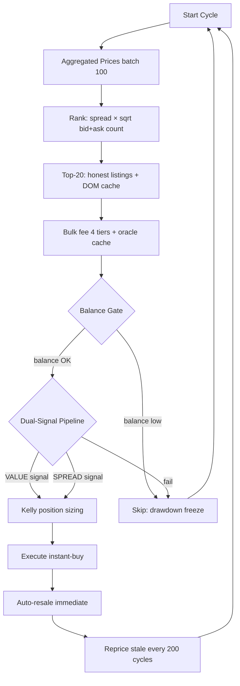

# SYSTEM_FLOW - DMarket Quantitative Engine (v15.8)

Этот документ описывает логическую цепочку работы бота в режиме **v15.8 (Algo-Pack Integrated Quantitative Engine)**.

---

## 🔄 Основной торговый цикл (30s pipeline)



### v15.7 Dual-Signal Pipeline (replaces 15-filter pipeline)

```
VALUE SIGNAL (primary):
  rarity_mult × oracle_ask > ask × (1 + FEE_RATE + WITHDRAWAL_FEE + MIN_MARGIN)
  → Float premium (1.08-1.30×)
  → Pattern/phase premium (1.0-5.0×)
  → Sticker combo (+50-100%)
  → Filler demand (1.15×)
  → est_sell = oracle_ask × rarity_mult
  → BUY if est_sell > ask × cost

SPREAD SIGNAL (fallback):
  best_bid > best_ask × (1 + FEE_RATE + WITHDRAWAL_FEE + MIN_MARGIN)
  → Classic intra-market spread arbitrage
```

```
BALANCE GATE:
  effective = max(0, balance - BALANCE_RESERVE_USD)
  max_price = max(MAX_SNIPING_PRICE_FLOOR, effective * 0.10)
  if item.price > max_price → SKIP

DRAWDOWN GATE:
  if balance < peak_balance * 0.85 → FREEZE (sell-only mode)

KELLY GATE:
  f* = win_rate - (1 - win_rate) / win_loss_ratio
  position_size = capital * 0.50 * f*  (Half Kelly)

VELOCITY GATE:
  weekly_sales / avg_balance < 0.5 → PAUSE BUYING

LOCK-AWARE CAP:
  if trade-locked items > 80% of max → SKIP new buys
```

---

## 🛡 Компоненты защиты

### 1. Balance Gate (v14.4+)
Dynamic max price, reserve buffer, drawdown freeze. Адаптация под текущий баланс DMarket.

### 2. Value Detection Scanner (v14.9)
Dual-signal pipeline: VALUE (rarity-based) + SPREAD (intra-market fallback). Покупка редких предметов даже без естественного спреда.

### 3. Trend Guard (SQLite)
Сверяет текущую цену с последними 10 записями в базе данных. Если цена ниже скользящей средней (SMA-5) более чем на 10%, покупка блокируется.

### 4. Event Shield
Считывает `data/cs2_events.json`. Если текущая дата попадает в интервал Major или Steam Sale, маржинальный порог автоматически повышается до 10% для компенсации волатильности.

### 5. Kelly Position Sizing (v14.4+)
Fractional Half Kelly: `KELLY_FRACTION=0.50`. Снижает просадку на ~50% при 85% от полного роста.

### 6. Pydantic Gate
Каждый объект сделки проходит через схему валидации, которая блокирует некорректные типы данных, отрицательные цены и предметы не из белого списка (CS2).

---

## 📡 Сетевой уровень

- **Transport**: `aiohttp` (Asynchronous HTTP).
- **Security**: Ed25519 NACL signatures with Rust (fast) or pynacl (fallback).
- **Speed**: Пакетная обработка (`Batching`) до 100 таргетов в одном запросе.
- **Quota**: Free oracles with in-memory cache (5 min TTL).

---

## 🐳 Docker Deployment

- **Multi-stage build**: Builder (Rust + Python) → Runtime (~250 MB)
- **Architectures**: x86_64 + aarch64/ARM64 (Raspberry Pi 4/5, mini-PCs)
- **Health check**: `/healthz` на порту 9091
- **Persistence**: Docker volumes для `data/` (SQLite) и `logs/`
- **Memory limits**: 512 MB (main), 256 MB (Telegram)


---

🦅 *DMarket Quantitative Engine | v14.9 | June 2026*
