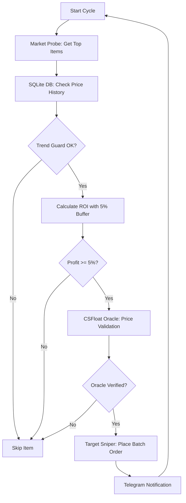

# SYSTEM_FLOW - DMarket Quantitative Engine

Этот документ описывает логическую цепочку работы бота в режиме **Phase 7 (Pure Quantitative)**.

---

## 🔄 Основной торговый цикл (The Loop)

---

## 🛡 Компоненты защиты

### 1. Trend Guard (SQLite)
Сверяет текущую цену с последними 10 записями в базе данных. Если цена ниже скользящей средней (SMA-5) более чем на 10%, покупка блокируется.

### 2. Event Shield
Считывает `data/cs2_events.json`. Если текущая дата попадает в интервал Major или Steam Sale, маржинальный порог автоматически повышается до 10% для компенсации волатильности.

### 3. Pydantic Gate
Каждый объект сделки проходит через схему валидации, которая блокирует некорректные типы данных, отрицательные цены и предметы не из белого списка (CS2/Rust).

---

## 📡 Сетевой уровень

- **Transport**: `aiohttp` (Asynchronous HTTP).
- **Security**: Ed25519 NACL signatures for every request.
- **Speed**: Пакетная обработка (`Batching`) до 50 таргетов в одном запросе.

---

*Last Updated: April 2026*

---
🦅 *DMarket Quantitative engine | v7.0 | 2026*